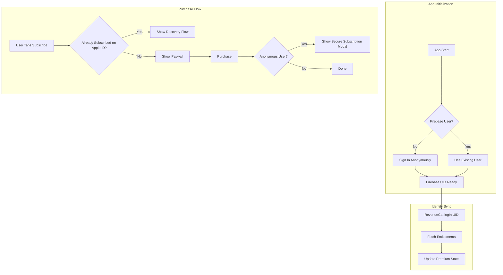

# Account-Bound Subscription Access for Calmnest

## Current State Analysis

The codebase has Firebase Auth with all 4 providers and RevenueCat, but **RevenueCat uses device-based identification** - not synced with Firebase UID. This is the core gap causing subscriptions to follow devices rather than accounts.

**Key files to modify:**

- [`src/contexts/AuthContext.tsx`](apps/calmnest-headspace/src/contexts/AuthContext.tsx) - Auth state management
- [`src/contexts/SubscriptionContext.tsx`](apps/calmnest-headspace/src/contexts/SubscriptionContext.tsx) - RevenueCat integration
- [`app/settings.tsx`](apps/calmnest-headspace/app/settings.tsx) - Settings screen
- [`src/components/PaywallModal.tsx`](apps/calmnest-headspace/src/components/PaywallModal.tsx) - Purchase UI

---

## Architecture



---

## Implementation Details

### 1. Unified Auth + Subscription State Manager

Create a new `AuthSubscriptionManager` that coordinates Firebase Auth and RevenueCat identity.

**New file:** `src/managers/AuthSubscriptionManager.ts`

```typescript
// Use the existing constant - verify it matches RevenueCat dashboard identifier
import { PREMIUM_ENTITLEMENT_ID } from "../contexts/SubscriptionContext";

// Core sync logic
async function syncRevenueCatIdentity(firebaseUid: string): Promise<void> {
  const { customerInfo } = await Purchases.logIn(firebaseUid);
  // Update entitlement state based on customerInfo.entitlements.active[PREMIUM_ENTITLEMENT_ID]
}

async function handleAuthStateChange(user: FirebaseUser | null): Promise<void> {
  if (!user) {
    await Purchases.logOut(); // Reset to anonymous RC user
    return;
  }
  await syncRevenueCatIdentity(user.uid);
}
```

**Key behaviors:**

- On app start: Ensure Firebase session exists (anonymous if needed), then `Purchases.logIn(uid)`
- On auth state change: Re-sync RevenueCat identity
- On logout: `Purchases.logOut()` to reset RC identity

### 2. Anonymous Upgrade Flow (Linking)

Modify [`AuthContext.tsx`](apps/calmnest-headspace/src/contexts/AuthContext.tsx) to always attempt linking first for anonymous users.

```typescript
async function upgradeAnonymousAccount(
  credential: AuthCredential,
): Promise<void> {
  if (!auth.currentUser?.isAnonymous) throw new Error("Not anonymous");

  try {
    await linkWithCredential(auth.currentUser, credential);
    // UID stays the same, RevenueCat identity unchanged
  } catch (error) {
    if (error.code === "auth/credential-already-in-use") {
      // Show credential collision modal (see section 3)
      throw new CredentialCollisionError(error.credential);
    }
    throw error;
  }
}
```

### 3. Credential Collision Handling

**New component:** `src/components/CredentialCollisionModal.tsx`

When linking fails because the credential belongs to another account:

```
┌─────────────────────────────────────────┐
│                                         │
│  This Google account is already linked  │
│  to another CalmNest account.           │
│                                         │
│  ┌─────────────────────────────────┐    │
│  │  Sign in to that account        │    │
│  └─────────────────────────────────┘    │
│                                         │
│  ┌─────────────────────────────────┐    │
│  │  Use a different method         │    │
│  └─────────────────────────────────┘    │
│                                         │
└─────────────────────────────────────────┘
```

If user chooses "Sign in to that account", show warning first:

```
┌─────────────────────────────────────────┐
│  ⚠️ Switch Accounts?                    │
│                                         │
│  If you switch accounts, you may not    │
│  see data from your current account     │
│  unless it's backed up/synced.          │
│                                         │
│  [Cancel]              [Switch Account] │
└─────────────────────────────────────────┘
```

Then sign in with the pending credential using `signInWithCredential()`.

### 4. Provider Management Screen

**New file:** `app/account-security.tsx`

Accessible from Settings, this screen shows:

```
┌─────────────────────────────────────────┐
│  ← Account Security                     │
├─────────────────────────────────────────┤
│  LINKED SIGN-IN METHODS                 │
│                                         │
│  ✓ Google (john@gmail.com)    [Change]  │
│  ✓ Apple (j***@privaterelay)  [Remove]  │
│                                         │
│  ADD SIGN-IN METHOD                     │
│                                         │
│  + Email & Password                     │
│  + Google (if not linked)               │
│  + Apple (if not linked)                │
│                                         │
├─────────────────────────────────────────┤
│  EMAIL & PASSWORD                       │
│  (if email provider linked)             │
│                                         │
│  [Change Email Address]                 │
│  [Reset Password]                       │
└─────────────────────────────────────────┘
```

**Same-provider switching logic (Google→Google, Apple→Apple):**

1. Check if user has another linked provider
2. If yes: unlink old → link new
3. If no: prompt to add temporary method first, then switch

```typescript
async function switchGoogleAccount(): Promise<void> {
  const hasOtherProvider = user.providerData.some(
    (p) => p.providerId !== "google.com",
  );

  if (!hasOtherProvider) {
    // Guide user to link email/Apple first
    showModal("Add another sign-in method before switching Google accounts");
    return;
  }

  // Get new Google credential
  const newCredential = await getGoogleCredential();

  // Unlink old, link new
  await unlink(auth.currentUser, "google.com");
  await linkWithCredential(auth.currentUser, newCredential);
}
```

### 5. Restore Purchases + Recovery Wizard

**Modify:** [`SubscriptionContext.tsx`](apps/calmnest-headspace/src/contexts/SubscriptionContext.tsx)

**Important:** Use the existing `PREMIUM_ENTITLEMENT_ID` constant (currently `"CalmNest Premium"`). Verify this matches the **Entitlement Identifier** in RevenueCat dashboard (often something simple like `premium`), not the display name. Mismatches will cause restore to mis-detect.

```typescript
async function restorePurchases(): Promise<RestoreResult> {
  const customerInfo = await Purchases.restorePurchases();
  const hasEntitlement =
    customerInfo.entitlements.active[PREMIUM_ENTITLEMENT_ID];

  if (hasEntitlement) {
    return { success: true };
  }

  // Detect if Apple ID has an ACTIVE subscription owned by different account
  // Priority order (most reliable first):
  // 1. activeSubscriptions array - contains product IDs with active subscriptions
  // 2. Check entitlements for any active entitlement (in case of multiple products)
  // 3. Fall back to allExpirationDates with future expiration

  const hasActiveSubscription = detectActiveSubscriptionOnAppleId(customerInfo);

  if (hasActiveSubscription) {
    return {
      success: false,
      reason: "different_account",
      showRecoveryWizard: true,
    };
  }

  return { success: false, reason: "no_subscription" };
}

/**
 * Detect if the Apple ID has an active subscription that this account doesn't own.
 * Uses the most direct signals available in CustomerInfo.
 */
function detectActiveSubscriptionOnAppleId(
  customerInfo: CustomerInfo,
): boolean {
  // 1. Best signal: activeSubscriptions contains product IDs currently active
  if (customerInfo.activeSubscriptions.length > 0) {
    return true;
  }

  // 2. Check if any entitlement is active (covers edge cases)
  const anyActiveEntitlement =
    Object.keys(customerInfo.entitlements.active).length > 0;
  if (anyActiveEntitlement) {
    return true;
  }

  // 3. Fallback: Check expiration dates for non-expired subscriptions
  const now = new Date();
  for (const [productId, expirationDate] of Object.entries(
    customerInfo.allExpirationDates,
  )) {
    if (expirationDate && new Date(expirationDate) > now) {
      return true;
    }
  }

  // No active subscription detected - don't send user to recovery wizard
  // (allPurchaseDates alone is insufficient as it includes expired/cancelled)
  return false;
}
```

**New component:** `src/components/RecoveryWizard.tsx`

```
┌─────────────────────────────────────────┐
│  Recover Your Subscription              │
│                                         │
│  We found an active subscription on     │
│  this device's App Store account, but   │
│  it's linked to a different in-app      │
│  account.                               │
│                                         │
│  Try signing in with:                   │
│                                         │
│  ┌─────────────────────────────────┐    │
│  │  🍎 Sign in with Apple          │    │
│  └─────────────────────────────────┘    │
│  ┌─────────────────────────────────┐    │
│  │  🔵 Sign in with Google         │    │
│  └─────────────────────────────────┘    │
│  ┌─────────────────────────────────┐    │
│  │  ✉️  Sign in with Email          │    │
│  └─────────────────────────────────┘    │
│                                         │
│  ┌─────────────────────────────────┐    │
│  │  💬 Contact Support             │    │
│  └─────────────────────────────────┘    │
│                                         │
│  ℹ️ Don't remember your login?          │
│     [View recovery tips]                │
└─────────────────────────────────────────┘
```

**Recovery tips (expandable section):**

- Apple: "If you used 'Hide My Email', check your Apple ID settings → Sign in with Apple → Apps Using Apple ID"
- Google: "Try any Google accounts you may have used"
- Email: "Use 'Forgot Password' if you remember the email but not the password"

**Anti-enumeration:** Use generic error messages like "Unable to sign in" rather than "Email not found" vs "Wrong password".

### 6. Paywall Behavior

**Modify:** [`PaywallModal.tsx`](apps/calmnest-headspace/src/components/PaywallModal.tsx)

Before showing purchase options, check for existing subscription:

```typescript
const customerInfo = await Purchases.getCustomerInfo();

// Use the same robust detection logic from restore
const hasActiveOnAppleId = detectActiveSubscriptionOnAppleId(customerInfo);
const hasEntitlement = customerInfo.entitlements.active[PREMIUM_ENTITLEMENT_ID];

if (hasActiveOnAppleId && !hasEntitlement) {
  // Apple ID is subscribed but current account doesn't own it
  // Show recovery-first UI instead of purchase options
  return <RecoveryPaywall onRecover={openRecoveryWizard} />;
}

// Normal paywall
return <StandardPaywall />;
```

**Recovery-first paywall:**

```
┌─────────────────────────────────────────┐
│  You already have an active             │
│  subscription                           │
│                                         │
│  This Apple ID has a CalmNest           │
│  subscription, but it's linked to       │
│  a different account.                   │
│                                         │
│  ┌─────────────────────────────────┐    │
│  │  Recover My Subscription        │    │
│  └─────────────────────────────────┘    │
│                                         │
│  [Contact Support]                      │
└─────────────────────────────────────────┘
```

### 7. RevenueCat Dashboard Configuration

Configure in RevenueCat dashboard:

- **Transfer behavior:** Set to "Keep with original App User ID" (prevents restore from transferring ownership)
- This ensures `restorePurchases()` refreshes status but doesn't move the subscription to a new UID

---

## File Structure

```
apps/calmnest-headspace/
├── src/
│   ├── managers/
│   │   └── AuthSubscriptionManager.ts    # NEW - coordinates auth + RC
│   ├── contexts/
│   │   ├── AuthContext.tsx               # MODIFY - add linking logic
│   │   └── SubscriptionContext.tsx       # MODIFY - add RC identity sync
│   ├── components/
│   │   ├── CredentialCollisionModal.tsx  # NEW - handles link conflicts
│   │   ├── RecoveryWizard.tsx            # NEW - account recovery flow
│   │   ├── AccountSwitchWarning.tsx      # NEW - data warning modal
│   │   ├── PaywallModal.tsx              # MODIFY - recovery-first logic
│   │   └── AccountPromptModal.tsx        # MODIFY - secure subscription
│   └── hooks/
│       └── useProviderManagement.ts      # NEW - link/unlink helpers
├── app/
│   ├── settings.tsx                      # MODIFY - add account security link
│   └── account-security.tsx              # NEW - provider management screen
```

---

## Key Edge Cases Handled

| Scenario | Behavior |

| -------------------------------------------- | ---------------------------------------------------------- |

| Anonymous purchases then closes app | UID persisted, premium stays |

| Anonymous links Google (success) | UID unchanged, now has Google provider |

| Anonymous links Google (collision) | Show collision modal with sign-in/different-method options |

| User signs out, signs into different UID | Premium OFF, recovery wizard available |

| Restore on wrong account | Show recovery wizard, not "contact support" dead-end |

| Google→Google switch with only Google linked | Prompt to add another method first |

| Last provider unlink attempt | Block with "You must have at least one sign-in method" |

---

## Security Considerations

- **Anti-enumeration:** Never reveal if an email exists in the system
- **No entitlement hijacking:** RevenueCat transfer behavior prevents ownership moves
- **Credential collision:** Blocks linking but offers safe sign-in path with data warning
- **Session persistence:** Firebase auth persisted with AsyncStorage, survives app restarts
