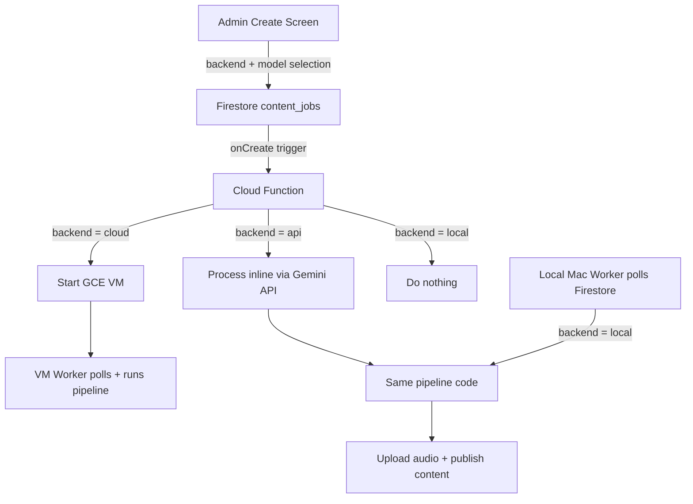

# Multi-Backend Content Factory

## Architecture



## Data Model Changes

Add a `backend` field to jobs in [types.ts](apps/calmdemy/src/features/admin/types.ts):

```typescript
export type JobBackend = "cloud" | "api" | "local";
```

Add `backend` to `ContentJob` and `CreateJobInput`. Each model in [constants/models.ts](apps/calmdemy/src/features/admin/constants/models.ts) gets a `backend` property so the UI can filter models per backend.

## New Models

**LLM models to add:**

- `gemini-2.5-flash` (backend: api) - Best free option, fast
- `gemini-2.5-pro` (backend: api) - Best quality, free tier
- `ollama-local` (backend: local) - Runs any model via Ollama on Mac

**TTS models to add:**

- `gemini-tts-flash` (backend: api) - Gemini 2.5 Flash TTS, free tier
- `gemini-tts-pro` (backend: api) - Gemini 2.5 Pro TTS, paid only

**Existing models stay as-is:**

- `gemma-3-12b`, `llama-3.1-8b` (backend: cloud)
- `piper`, `coqui-xtts-v2` (backend: cloud or local)

## Worker Changes (Python)

### New adapter: `worker/models/llm_gemini_api.py`

- Uses `google-genai` Python SDK (official Google AI SDK)
- Calls Gemini API with the same prompt templates
- `load()` is a no-op (no model to load)
- `generate()` calls the API, returns text
- Needs `GEMINI_API_KEY` env var

### New adapter: `worker/models/tts_gemini.py`

- Uses Gemini TTS API (`gemini-2.5-flash-preview-tts`)
- `synthesize()` sends text, receives audio bytes, writes WAV
- Same interface as `TTSBase`

### New adapter: `worker/models/llm_ollama.py`

- Calls Ollama REST API at `http://localhost:11434/api/generate`
- `load()` is a no-op (Ollama manages models)
- `generate()` sends prompt, returns text
- Configurable model name (user picks in Ollama)

### Update `worker/models/registry.py`

- Register all new adapters with their model IDs

### Update `worker/requirements.txt`

- Add `google-genai` for Gemini API SDK

## Cloud Function Changes

Update [cloud-function/main.py](apps/calmdemy/worker/cloud-function/main.py):

- Read the `backend` field from the new job document
- `"cloud"` -> start VM (current behavior)
- `"api"` -> process the job inline using a lightweight pipeline (Gemini API for LLM + Gemini TTS for audio, upload result). This requires adding the pipeline deps to the Cloud Function, OR start the VM anyway (simpler but costs more).
- `"local"` -> do nothing (local worker handles it)

**Decision:** For API jobs, the simplest v1 is to still start the VM (it already has ffmpeg, piper, etc.). The only difference is the LLM adapter calls an API instead of loading a GPU model. This avoids duplicating pipeline code in the Cloud Function. Optimization later: run API jobs serverlessly.

## Local Worker Script

Create `worker/local_worker.py`:

- Same logic as `main.py` but:
  - Filters for `backend = "local"` jobs only
  - No self-shutdown logic
  - Runs on the Mac as a foreground process
  - Uses application default credentials or a service account key
- User runs: `python3 local_worker.py` on their Mac
- Requires: `ffmpeg`, `piper` (or skip if using API TTS), Ollama running

## Admin UI Changes

### [constants/models.ts](apps/calmdemy/src/features/admin/constants/models.ts)

- Add `backend` field to `ModelOption` interface
- Add Gemini API and Ollama models to `LLM_MODELS`
- Add Gemini TTS models to `TTS_MODELS`
- Add helper `getModelsForBackend(backend)`

### [app/admin/create.tsx](apps/calmdemy/app/admin/create.tsx)

- Add a **Backend selector** at the top (Cloud / API / Local) as a segmented control
- Filter LLM and TTS model dropdowns based on selected backend
- Default backend to "api" (best experience)
- Show a note under each backend:
  - Cloud: "Runs on GCE VM with GPU"
  - API: "Uses Gemini API (free tier)"
  - Local: "Runs on your Mac (Ollama must be running)"

### [types.ts](apps/calmdemy/src/features/admin/types.ts)

- Add `JobBackend` type
- Add `backend` to `ContentJob` and `CreateJobInput`

### [adminRepository.ts](apps/calmdemy/src/features/admin/data/adminRepository.ts)

- Include `backend` field when creating jobs

## File Summary

| File | Action |

| -------------------------------------------- | ---------------------------------------------------- |

| `src/features/admin/types.ts` | Add `JobBackend` type, add `backend` field |

| `src/features/admin/constants/models.ts` | Add `backend` to models, add Gemini + Ollama entries |

| `app/admin/create.tsx` | Add backend selector, filter models |

| `src/features/admin/data/adminRepository.ts` | Pass `backend` when creating job |

| `worker/models/llm_gemini_api.py` | New - Gemini API LLM adapter |

| `worker/models/tts_gemini.py` | New - Gemini TTS adapter |

| `worker/models/llm_ollama.py` | New - Ollama LLM adapter |

| `worker/models/registry.py` | Register new adapters |

| `worker/requirements.txt` | Add `google-genai` |

| `worker/cloud-function/main.py` | Route by backend field |

| `worker/local_worker.py` | New - local Mac worker script |

| `worker/config.py` | Add `GEMINI_API_KEY` config |
