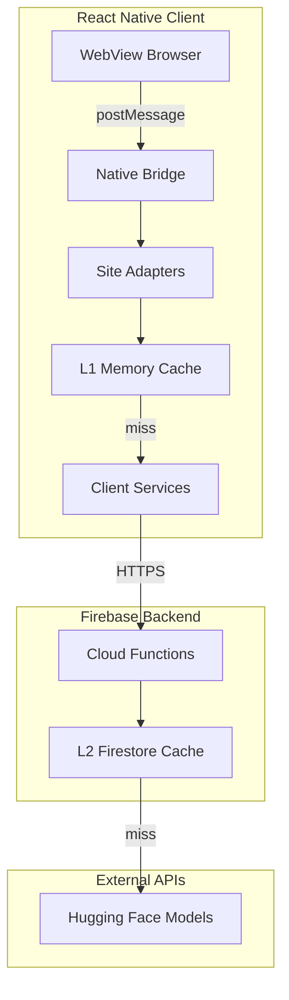

# PeaceNest Browser Structure Implementation

## Architecture Overview



## Candidate Contract

The most critical design decision: **each candidate ID must bind to the removable container node, not the text span**. This prevents leaving empty shells when filtering.

```typescript
// src/adapters/types.ts

/** Content role determines classification routing */
type CandidateRole = "title" | "comment" | "description" | "paragraph";

/** Actions with no reveal path */
type FilterAction = "ALLOW" | "REMOVE" | "REWRITE" | "BLOCK_PAGE";

interface Candidate {
  /** Unique ID for this candidate (UUID or DOM path) */
  id: string;

  /** Text extracted from child node for classification */
  text: string;

  /** Hash of text for cache keying: sha256(text + role + policyVersion) */
  textHash: string;

  /** Role determines which model/thresholds apply */
  role: CandidateRole;

  /** Site identifier for adapter routing */
  site: "youtube" | "twitter" | "news";

  /** Page surface for metrics */
  surface: "home" | "search" | "watch" | "comments";

  /**
   * CRITICAL: Reference to the container node to remove/rewrite.
   * This is NOT the text span - it's the entire card/comment/block.
   * Stored as CSS selector path for serialization.
   */
  containerSelector: string;
}

interface SiteAdapter {
  /** Check if this adapter handles the current URL */
  matches(url: string): boolean;

  /** Extract text from a DOM node (title, comment body, etc.) */
  extractTextFromNode(node: Element): string;

  /** Find the removable container for a given text node */
  getContainerForNode(node: Element): Element | null;

  /** Get all candidate nodes on current page */
  discoverCandidates(): Candidate[];

  /** Health check: returns expected candidate counts by surface */
  getHealthMetrics(): { surface: string; count: number }[];
}
```

**REWRITE semantics**: Replace container innerHTML with a neutral placeholder that preserves approximate height/layout. No title, no thumbnail, no curiosity bait. Example: "Content filtered" in muted text, same card dimensions.

## Caching and Latency Strategy

**Target**: p95 time-to-filter < 300ms to prevent content flash.

### Two-Tier Cache

| Tier | Location | TTL | Purpose |

|------|----------|-----|---------|

| L1 | Client memory (Map) | 5 min | Instant hits for scroll/back navigation |

| L2 | Firestore | 24h (titles), 1h (comments) | Cross-session, analytics |

Cache key: `sha256(text + role + policyVersion)`

### Cold Start Mitigation

- Firebase Functions: set `minInstances: 1` in production to keep warm
- Client: show `FilterOverlay` until first classification batch returns
- Fallback mode: if backend latency > 2s, apply safe defaults (REMOVE for high-risk surfaces)

```typescript
// src/services/classificationService.ts

interface ClassifyRequest {
  candidates: {
    id: string;
    textHash: string;
    text: string;
    role: CandidateRole;
  }[];
  policyVersion: string; // e.g., "2024-01-v3"
}

interface ClassifyResponse {
  results: { id: string; action: FilterAction; confidence: number }[];
  cacheHits: number; // For metrics
  latencyMs: number;
}
```

## Adapter Resilience

YouTube changes DOM structure frequently. The adapter must detect breakage and fail safe.

### Health Monitoring

```typescript
// Adapter emits metrics every 30s or on navigation
interface AdapterHealthReport {
  site: string;
  surface: string;
  candidatesFound: number;
  selectorsWorking: boolean;
  timestamp: number;
}
```

### Safe Fallback Rules

| Condition | Fallback Action |

|-----------|-----------------|

| Home feed: 0 candidates found for 3+ loads | Hide entire feed section |

| Comments: selector returns null | Collapse comments section entirely |

| Adapter throws error | Block page with "Filtering unavailable" |

| Backend timeout > 5s | Show overlay, retry once, then block |

### Selector Versioning

```typescript
// src/adapters/YouTubeAdapter.ts
const SELECTORS = {
  version: "2024-01-v2",
  home: {
    card: "ytd-rich-item-renderer, ytd-video-renderer",
    title: "#video-title",
    container: (el: Element) =>
      el.closest("ytd-rich-item-renderer, ytd-video-renderer"),
  },
  comments: {
    thread: "ytd-comment-thread-renderer",
    body: "#content-text",
    container: (el: Element) => el.closest("ytd-comment-thread-renderer"),
  },
  // ... search, watch
};
```

## Privacy Posture

This product handles sensitive user-consumed content. Conservative defaults.

### Data Handling Rules

- **Default**: Never persist raw text. Store only: `textHash`, `action`, `role`, `timestamp`, `confidence`
- **Debug mode**: Opt-in only, local logging, never to production Firestore
- **HF tokens**: Never shipped to client. Only in Cloud Functions environment variables
- **Request logging**: Hash-only in production. Full text only in local dev with explicit flag

### Firestore Schema (Privacy-Safe)

```typescript
// functions/src/classify.ts - what we store
interface CacheEntry {
  textHash: string; // SHA-256, not reversible
  action: FilterAction;
  confidence: number;
  role: CandidateRole;
  policyVersion: string;
  createdAt: Timestamp;
  hitCount: number; // For analytics
}
// NO raw text field
```

## Benchmark Runner

Add `functions/src/benchmark.ts` as first-class artifact:

```typescript
// Input: JSONL with { text, role, expectedAction }
// Output: { accuracy, falsePositives, falseNegatives, byCategory }
```

Run on every policy version change to catch regressions before deploy.

## Folder Structure

```
apps/peacenest/
├── app/                          # Expo Router screens
│   ├── _layout.tsx               # Root layout with providers
│   ├── index.tsx                 # Entry -> redirects to browser
│   ├── browser.tsx               # Main WebView browser screen
│   └── settings.tsx              # Filter settings screen
├── src/
│   ├── components/
│   │   ├── WebViewBrowser.tsx    # WebView with bridge & injection
│   │   ├── FilterOverlay.tsx     # Flash prevention overlay
│   │   └── BlockedPage.tsx       # Blocked page replacement
│   ├── adapters/
│   │   ├── types.ts              # Candidate contract + SiteAdapter interface
│   │   ├── BaseAdapter.ts        # Abstract adapter with health reporting
│   │   ├── YouTubeAdapter.ts     # YouTube DOM selectors (versioned)
│   │   └── adapterHealth.ts      # Health monitoring + fallback logic
│   ├── contexts/
│   │   └── FilterContext.tsx     # Filter state, settings, metrics
│   ├── services/
│   │   ├── classificationService.ts  # Backend API + L1 cache
│   │   ├── cacheService.ts           # Two-tier cache logic
│   │   └── bridgeService.ts          # WebView message handling
│   ├── injection/
│   │   └── contentScript.ts      # JS to inject (MutationObserver + DOM ops)
│   ├── types/
│   │   └── index.ts              # Shared TypeScript types
│   └── firebase.ts               # Firebase config
└── functions/                    # Firebase Cloud Functions
    ├── src/
    │   ├── index.ts              # Function exports
    │   ├── classify.ts           # Classification endpoint + L2 cache
    │   ├── policy.ts             # Policy rules engine + thresholds
    │   └── benchmark.ts          # JSONL benchmark runner
    ├── package.json
    └── tsconfig.json
```

## Key Components to Implement

### 1. WebView Browser Component

- [src/components/WebViewBrowser.tsx](apps/peacenest/src/components/WebViewBrowser.tsx)
- Wraps `react-native-webview` with message bridge
- Injects content script on page load
- Handles `onMessage` for candidate batches
- Sends classification results back via `injectJavaScript`

### 2. Adapter System

- [src/adapters/types.ts](apps/peacenest/src/adapters/types.ts) - `Candidate`, `FilterAction`, `SiteAdapter` interfaces
- [src/adapters/YouTubeAdapter.ts](apps/peacenest/src/adapters/YouTubeAdapter.ts) - DOM selectors for Home, Search, Watch, Comments

### 3. Injected Content Script

- [src/injection/contentScript.ts](apps/peacenest/src/injection/contentScript.ts)
- MutationObserver setup
- Candidate extraction logic
- DOM editing functions (`remove`, `rewrite`)

### 4. Classification Service

- [src/services/classificationService.ts](apps/peacenest/src/services/classificationService.ts)
- Batches candidates to Firebase Function
- Handles responses and maps to actions

### 5. Firebase Cloud Function

- [functions/src/classify.ts](apps/peacenest/functions/src/classify.ts)
- Receives batch of texts
- Calls Hugging Face Inference API
- Returns actions per candidate ID
- Caches results in Firestore

### 6. Filter Context

- [src/contexts/FilterContext.tsx](apps/peacenest/src/contexts/FilterContext.tsx)
- User settings (enabled categories, sensitivity)
- Filter statistics

## Dependencies to Add

**Client:**

- `react-native-webview` - WebView component

**Functions:**

- `@huggingface/inference` - HF API client
- `firebase-admin` - Firestore access
- `firebase-functions` - Cloud Functions
