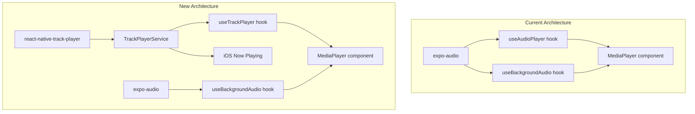

# React Native Track Player Integration

## Overview

Replace `expo-audio` with `react-native-track-player` to enable iOS Now Playing (Lock Screen/Control Center) integration. This is a significant refactoring that touches the core audio infrastructure while preserving all existing functionality.

## Critical Implementation Notes (from review)

These are must-fix items identified during plan review:

1. **Single initialization point** - Initialize TrackPlayer ONLY in `_layout.tsx`, never in hooks
2. **Proper playbackService export** - Must export the function correctly for `registerPlaybackService`
3. **Missing imports** - Include `IOSCategory` and `IOSCategoryMode` from the package
4. **Shared init promise** - Use a lock/promise to prevent race conditions during rapid calls
5. **Audio mixing on iOS** - Configure `IOSCategoryOptions` for ducking when ambient plays
6. **Queue ended cleanup** - Handle `PlaybackQueueEnded` event to clear Now Playing
7. **Swipe-kill testing** - Explicitly test Control Center behavior after app is killed

## Architecture Change



**Key Decision:** Keep `expo-audio` for background ambient sounds (rain, nature, etc.) since these need to mix with the main audio. Use `react-native-track-player` for primary content playback only.

---

## Files to Modify

| File | Action | Description |

|------|--------|-------------|

| `package.json` | Modify | Add react-native-track-player dependency |

| `index.js` | Create | Register playback service BEFORE app starts |

| `src/services/trackPlayerService.ts` | Create | Singleton init with shared promise |

| `src/services/playbackService.ts` | Create | Background event handlers |

| `src/hooks/useTrackPlayer.ts` | Create | State + controls hook (NO init) |

| `src/hooks/useAudioPlayer.ts` | Modify | Re-export useTrackPlayer |

| `src/hooks/useBackgroundAudio.ts` | Keep | No changes - expo-audio |

| `app/_layout.tsx` | Modify | ONLY init point |

| 10 player screens | Modify | Pass metadata to loadAudio |

| `ios/Podfile` | Auto | Updated by pod install |

---

## Step 1: Install and Configure react-native-track-player

### 1.1 Install Package

Use Expo's install command for version consistency:

```bash
npx expo install react-native-track-player
cd ios && pod install && cd ..
```

### 1.2 Create Track Player Service (with Singleton Init Promise)

File: [src/services/trackPlayerService.ts](apps/calmnest-headspace/src/services/trackPlayerService.ts) (NEW)

**FIX #1, #3, #6:** Single shared init promise prevents race conditions, includes correct imports.

```typescript
import TrackPlayer, {
  AppKilledPlaybackBehavior,
  Capability,
  IOSCategory,
  IOSCategoryMode,
  IOSCategoryOptions,
} from "react-native-track-player";

// FIX #6: Shared init promise to prevent race conditions
let initPromise: Promise<boolean> | null = null;

export async function setupTrackPlayer(): Promise<boolean> {
  // If already initializing/initialized, return the same promise
  if (initPromise) return initPromise;

  initPromise = (async () => {
    try {
      await TrackPlayer.setupPlayer({
        // FIX #3: Correct imports for iOS category
        iosCategory: IOSCategory.Playback,
        iosCategoryMode: IOSCategoryMode.SpokenAudio,
        // FIX #4: Allow mixing with ambient audio (ducking)
        iosCategoryOptions: [
          IOSCategoryOptions.MixWithOthers,
          IOSCategoryOptions.DuckOthers,
        ],
      });

      await TrackPlayer.updateOptions({
        // Capabilities for Lock Screen / Control Center
        capabilities: [
          Capability.Play,
          Capability.Pause,
          Capability.SkipToNext,
          Capability.SkipToPrevious,
          Capability.SeekTo,
        ],
        compactCapabilities: [Capability.Play, Capability.Pause],
        // What happens when app is killed
        android: {
          appKilledPlaybackBehavior:
            AppKilledPlaybackBehavior.StopPlaybackAndRemoveNotification,
        },
      });

      return true;
    } catch (error: any) {
      // Handle "already initialized" gracefully
      if (error?.message?.includes("already been initialized")) {
        console.log("TrackPlayer already initialized");
        return true;
      }
      console.error("Failed to setup Track Player:", error);
      // Reset promise so it can be retried
      initPromise = null;
      return false;
    }
  })();

  return initPromise;
}

export async function addTrack(track: {
  id: string;
  url: string;
  title: string;
  artist?: string;
  artwork?: string;
  duration?: number;
}): Promise<void> {
  await TrackPlayer.reset();
  await TrackPlayer.add({
    id: track.id,
    url: track.url,
    title: track.title,
    artist: track.artist || "CalmNest",
    artwork: track.artwork,
    duration: track.duration,
  });
}

// FIX #5: Clear Now Playing when session ends
export async function clearNowPlaying(): Promise<void> {
  await TrackPlayer.reset();
}
```

### 1.3 Register Playback Service

File: `index.js` (at project root - create if not exists)

**FIX #2:** Correct registration - return the playbackService function, not the module.

```javascript
import TrackPlayer from "react-native-track-player";
import { playbackService } from "./src/services/playbackService";

// Register MUST happen before app starts
// The callback must return the service function itself
TrackPlayer.registerPlaybackService(() => playbackService);
```

File: [src/services/playbackService.ts](apps/calmnest-headspace/src/services/playbackService.ts) (NEW)

**FIX #2, #5:** Named export and handle queue ended event.

```typescript
import TrackPlayer, { Event } from "react-native-track-player";

// Named export for proper registration
export async function playbackService() {
  // Remote control handlers
  TrackPlayer.addEventListener(Event.RemotePlay, () => TrackPlayer.play());
  TrackPlayer.addEventListener(Event.RemotePause, () => TrackPlayer.pause());
  TrackPlayer.addEventListener(Event.RemoteNext, () =>
    TrackPlayer.skipToNext(),
  );
  TrackPlayer.addEventListener(Event.RemotePrevious, () =>
    TrackPlayer.skipToPrevious(),
  );
  TrackPlayer.addEventListener(Event.RemoteSeek, (event) =>
    TrackPlayer.seekTo(event.position),
  );

  // FIX #5: Clear Now Playing when playback naturally ends
  TrackPlayer.addEventListener(Event.PlaybackQueueEnded, async (data) => {
    // Only reset if track actually finished (not skipped)
    if (data.position > 0) {
      // Small delay to allow any UI cleanup
      setTimeout(() => {
        TrackPlayer.reset();
      }, 500);
    }
  });

  // Handle playback errors
  TrackPlayer.addEventListener(Event.PlaybackError, (error) => {
    console.error("Playback error:", error);
  });
}
```

---

## Step 2: Create useTrackPlayer Hook

File: [src/hooks/useTrackPlayer.ts](apps/calmnest-headspace/src/hooks/useTrackPlayer.ts) (NEW)

**FIX #1:** This hook contains NO initialization. It's purely for state and controls. Initialization happens only in `_layout.tsx`.

```typescript
import { useCallback, useState } from "react";
import TrackPlayer, {
  useProgress,
  usePlaybackState,
  State,
  RepeatMode,
} from "react-native-track-player";
import { addTrack, clearNowPlaying } from "../services/trackPlayerService";

export interface TrackPlayerState {
  isPlaying: boolean;
  isLoading: boolean;
  duration: number;
  position: number;
  progress: number;
  formattedPosition: string;
  formattedDuration: string;
  error: string | null;
  isLooping: boolean;
  playbackRate: number;
}

/**
 * Hook for Track Player state and controls.
 * IMPORTANT: Does NOT initialize TrackPlayer - that happens in _layout.tsx
 */
export function useTrackPlayer() {
  const [error, setError] = useState<string | null>(null);
  const [isLooping, setIsLooping] = useState(false);
  const [playbackRate, setPlaybackRateState] = useState(1.0);

  const playbackState = usePlaybackState();
  const { position, duration } = useProgress(250); // Update every 250ms

  // NO initialization here - FIX #1
  // TrackPlayer is initialized once in _layout.tsx

  // Format time helper
  const formatTime = useCallback((seconds: number): string => {
    if (!isFinite(seconds) || seconds < 0) return "0:00";
    const mins = Math.floor(seconds / 60);
    const secs = Math.floor(seconds % 60);
    return `${mins}:${secs.toString().padStart(2, "0")}`;
  }, []);

  // Compute state
  const isPlaying = playbackState.state === State.Playing;
  const isLoading =
    playbackState.state === State.Buffering ||
    playbackState.state === State.Loading ||
    playbackState.state === State.Connecting;

  // Load audio with metadata for Now Playing
  const loadAudio = useCallback(
    async (
      url: string,
      metadata?: {
        id?: string;
        title?: string;
        artist?: string;
        artwork?: string;
        duration?: number;
      },
    ) => {
      try {
        setError(null);
        await addTrack({
          id: metadata?.id || url,
          url,
          title: metadata?.title || "Meditation",
          artist: metadata?.artist || "CalmNest",
          artwork: metadata?.artwork,
          duration: metadata?.duration,
        });
      } catch (err) {
        setError(err instanceof Error ? err.message : "Failed to load audio");
      }
    },
    [],
  );

  // Playback controls
  const play = useCallback(() => TrackPlayer.play(), []);
  const pause = useCallback(() => TrackPlayer.pause(), []);
  const stop = useCallback(async () => {
    await TrackPlayer.pause();
    await TrackPlayer.seekTo(0);
  }, []);
  const seekTo = useCallback((pos: number) => TrackPlayer.seekTo(pos), []);

  const setVolume = useCallback((vol: number) => {
    TrackPlayer.setVolume(Math.max(0, Math.min(1, vol)));
  }, []);

  const setLoop = useCallback(async (loop: boolean) => {
    await TrackPlayer.setRepeatMode(loop ? RepeatMode.Track : RepeatMode.Off);
    setIsLooping(loop);
  }, []);

  const setPlaybackRate = useCallback(async (rate: number) => {
    const clampedRate =
      Math.round(Math.max(0.5, Math.min(2.0, rate)) * 10) / 10;
    await TrackPlayer.setRate(clampedRate);
    setPlaybackRateState(clampedRate);
  }, []);

  const skipForward = useCallback(
    (seconds = 15) => {
      const newPos = Math.min(position + seconds, duration);
      TrackPlayer.seekTo(newPos);
    },
    [position, duration],
  );

  const skipBackward = useCallback(
    (seconds = 15) => {
      const newPos = Math.max(position - seconds, 0);
      TrackPlayer.seekTo(newPos);
    },
    [position],
  );

  // Cleanup - clears Now Playing
  const cleanup = useCallback(() => {
    clearNowPlaying();
  }, []);

  return {
    // State
    isPlaying,
    isLoading,
    duration,
    position,
    progress: duration > 0 ? position / duration : 0,
    formattedPosition: formatTime(position),
    formattedDuration: formatTime(duration),
    error,
    isLooping,
    playbackRate,

    // Actions
    loadAudio,
    play,
    pause,
    stop,
    seekTo,
    setVolume,
    setLoop,
    setPlaybackRate,
    skipForward,
    skipBackward,
    cleanup,

    // For sleep timer compatibility
    player: {
      volume: 1,
      set volume(v: number) {
        TrackPlayer.setVolume(v);
      },
    },
  };
}
```

---

## Step 3: Update useAudioPlayer for Backwards Compatibility

File: [src/hooks/useAudioPlayer.ts](apps/calmnest-headspace/src/hooks/useAudioPlayer.ts)

Option A (Recommended): Re-export the new hook with the same name:

```typescript
// Re-export useTrackPlayer as useAudioPlayer for backwards compatibility
export { useTrackPlayer as useAudioPlayer } from "./useTrackPlayer";
export type { TrackPlayerState as AudioPlayerState } from "./useTrackPlayer";
```

This means all 10 player screens will automatically use the new Track Player without any changes.

---

## Step 4: Update MediaPlayer to Pass Metadata

The `MediaPlayer` component needs to pass metadata (title, artist, artwork) to the audio player so it shows on the Lock Screen.

File: [src/components/MediaPlayer.tsx](apps/calmnest-headspace/src/components/MediaPlayer.tsx)

Update the `loadAudio` call pattern. Currently, screens load audio like this:

```typescript
// Current (in screen components)
audioPlayer.loadAudio(audioUrl);
```

Change to pass metadata:

```typescript
// New pattern
audioPlayer.loadAudio(audioUrl, {
  id: contentId,
  title: title,
  artist: instructor || "CalmNest",
  artwork: artworkThumbnailUrl,
  duration: durationMinutes * 60,
});
```

This change needs to be made in each of the 10 player screens:

- `app/course/session/[id].tsx`
- `app/emergency/[id].tsx`
- `app/music/[id].tsx`
- `app/album/track/[id].tsx`
- `app/sleep/[id].tsx`
- `app/series/chapter/[id].tsx`
- `app/sleep/meditation/[id].tsx`
- `app/meditation/[id].tsx`
- `app/downloads/player.tsx`
- `app/sleep-sounds.tsx`

---

## Step 5: Initialize Track Player in App Layout (SINGLE BOOTSTRAP POINT)

File: [app/\_layout.tsx](apps/calmnest-headspace/app/_layout.tsx)

**FIX #1:** This is the ONLY place in the entire app that calls `setupTrackPlayer()`. Do NOT call it from hooks or components.

```typescript
import { useEffect, useState } from "react";
import { setupTrackPlayer } from "../src/services/trackPlayerService";

export default function RootLayout() {
  const [isTrackPlayerReady, setIsTrackPlayerReady] = useState(false);

  // Initialize TrackPlayer ONCE on app start
  useEffect(() => {
    setupTrackPlayer()
      .then((success) => {
        setIsTrackPlayerReady(success);
        if (!success) {
          console.warn("TrackPlayer failed to initialize");
        }
      })
      .catch((error) => {
        console.error("TrackPlayer init error:", error);
      });
  }, []);

  // Optionally show loading state until TrackPlayer is ready
  // Or just proceed - the hook will handle buffering states

  return (
    // ... rest of layout
  );
}
```

**Why here?**

- Runs once before any player screens mount
- Shared promise in `trackPlayerService.ts` prevents duplicate calls
- Hooks remain pure (state + controls only)

---

## Step 6: iOS Configuration

### 6.1 Enable Background Audio

File: `ios/CalmNest/Info.plist` - Verify these keys exist:

```xml
<key>UIBackgroundModes</key>
<array>
  <string>audio</string>
</array>
```

### 6.2 Rebuild iOS App

```bash
cd ios && pod install && cd ..
npx expo run:ios
```

---

## Features Mapping

| Feature | Current (expo-audio) | New (track-player) |

| --------------- | ---------------------------------- | --------------------------------------------- |

| Play/Pause | `player.play()` / `player.pause()` | `TrackPlayer.play()` / `TrackPlayer.pause()` |

| Seek | `player.seekTo(pos)` | `TrackPlayer.seekTo(pos)` |

| Volume | `player.volume = x` | `TrackPlayer.setVolume(x)` |

| Loop | `player.loop = true` | `TrackPlayer.setRepeatMode(RepeatMode.Track)` |

| Speed | `player.setPlaybackRate(rate)` | `TrackPlayer.setRate(rate)` |

| Progress | `useAudioPlayerStatus(player)` | `useProgress()` |

| State | `status.playing` | `usePlaybackState()` |

| Now Playing | Not supported | Automatic with metadata |

| Remote Controls | Not supported | Automatic with capabilities |

---

## Background Audio Mixing Strategy

Keep `expo-audio` for ambient background sounds because:

1. Track Player is designed for single-track focused playback
2. We need to mix ambient sounds (rain, fire, etc.) with main content
3. Ambient sounds don't need Now Playing integration

The `useBackgroundAudio` hook remains unchanged and continues to use `expo-audio`.

---

## Testing Checklist (Critical 8 from Review)

These are the most important tests to run after the refactor:

| # | Test | Expected Behavior |

|---|------|-------------------|

| 1 | Play ambient loop then start session | Both play together (ambient ducks slightly) |

| 2 | Lock screen play/pause | Controls appear and work |

| 3 | Scrub from lock screen | SeekTo position updates correctly |

| 4 | Background app (home button) | Controls still work, audio continues |

| 5 | Swipe-kill app while playing | Control Center still shows Now Playing (or stops gracefully) |

| 6 | Session ends naturally | Now Playing clears (PlaybackQueueEnded handler) |

| 7 | Incoming call / Siri interruption | Audio resumes gracefully after interruption |

| 8 | Rapidly tap play on different sessions | No "already initialized" error, no queue corruption |

### Extended Testing

9. AirPods remote play/pause works
10. Sleep timer still works (volume fade + pause)
11. Playback speed control works (0.5x - 2.0x)
12. Loop mode works
13. Skip forward/backward works
14. Progress tracking and resume works
15. Autoplay next track works
16. Downloaded content plays offline

---

## iOS Audio Mixing Notes (Issue #4)

On iOS, there's only ONE underlying `AVAudioSession` for the whole app. When TrackPlayer sets its category/mode, it affects expo-audio too.

**Configuration chosen:**

```typescript
iosCategoryOptions: [
  IOSCategoryOptions.MixWithOthers,  // Allow ambient to play alongside
  IOSCategoryOptions.DuckOthers,     // Ambient volume reduces when session plays
],
```

**Potential issues to watch:**

- Ambient loop might stop/mute unexpectedly
- Ambient might resume at wrong volume
- Silent switch behavior might differ

If issues arise, adjust `IOSCategoryOptions` based on UX requirements.

---

## Rollback Plan

If issues arise, the original `useAudioPlayer.ts` using `expo-audio` can be restored:

1. Keep `useAudioPlayer.expo.ts` as backup (rename current file before changes)
2. If rollback needed, change the re-export back to the expo-audio implementation
3. Remove TrackPlayer initialization from `_layout.tsx`
